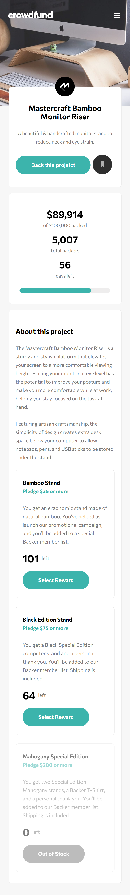
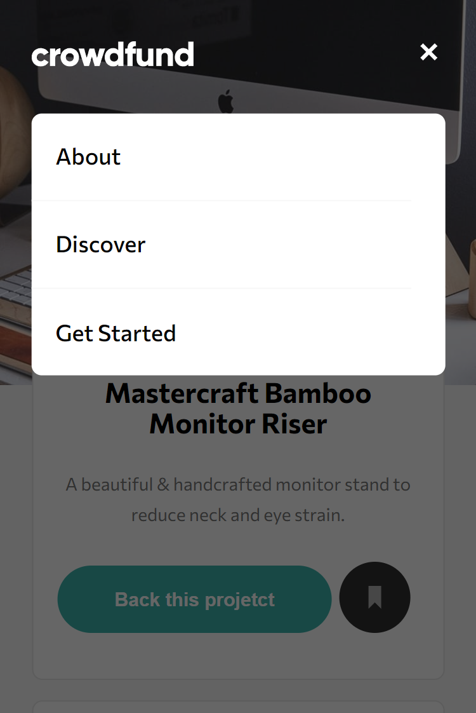

# Crowdfunding product page
Solução para criar uma página de produto de crowdfunding em HTML, CSS e JavaScript, responsiva para mobile e desktop

## Índice

- [Visão geral](#visao-geral)
  - [O Desafio](#o-desafio)
  - [Screenshot](#screenshot)
- [Minha caminhada](#minha-caminhada)
  - [Propriedades](#propriedades)
  - [O que aprendi](#o-que-aprendi)
  - [Recursos](#recursos)
- [Autor](#autor)

## Visão Geral

### O Desafio

Os usuários devem ser capazes de:

- Vizualizar o layout ideal para o site, dependendo do tamanho da tela do dispositivo, mobile (375px) ou desktop (1440px)
- Vizualizar os estados de foco para todos os elementos interativos na página

### Screenshots

<html>
    <h4>Layout mobile</h4>
    
    <h4>Menu mobile</h4>
    
    <!--
    <h4></h4>
    
    <h4>Layout desktop</h4>
    
    <h4></h4>
    
    -->
</html>

## Minha caminhada

- [x] Preparativos do layout com mobile-first 
- [x] Navbar
- [x] Product section
- [x] Metrics section
- [x] About section
- [x] Navbar menu
- [x] Product modal
- [ ] Acknowledgment modal
- [ ] Layout desktop
- [ ] Estado de foco dos elementos

### Propriedades

- Mobile-first
- Semântica HTML
- CSS BEM
- CSS Flexbox
- CSS Grid
- CSS Reaproveitável, limpo e flexível

### Meu aprendizado
...

Trechos de destaque:

HTML
```html
...

...
```
CSS
```css

```
JavaScript
```javascript

```

### Recursos

- [CSS - Blocos, Elementos e Modificadores](https://getbem.com/introduction/) - Este é um artigo que vai te fazer entender a boa prática, para nomear as suas classes.

- [O desafio da Frontend Mentor](https://www.frontendmentor.io/challenges/crowdfunding-product-page-7uvcZe7ZR) - Neste link você encontrará o desafio que foi solucionado aqui.

## Autor

- LinkedIn - [Pedro A. Lima](https://www.linkedin.com/in/pedrolima626/)
