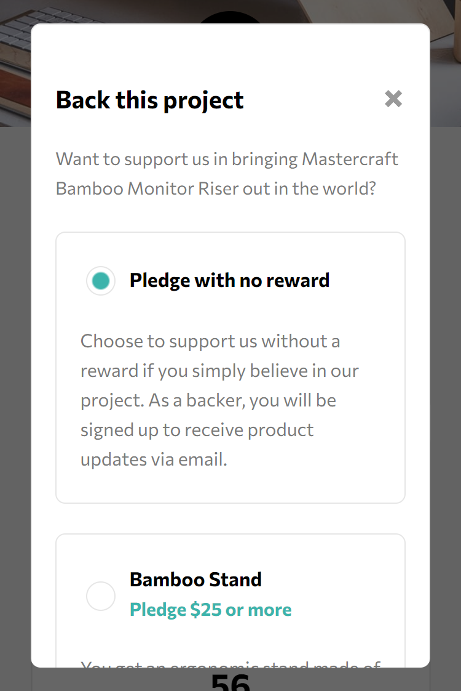
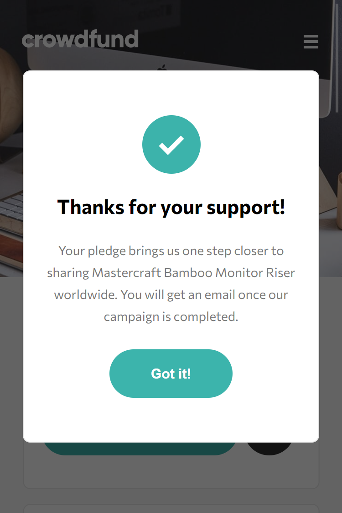
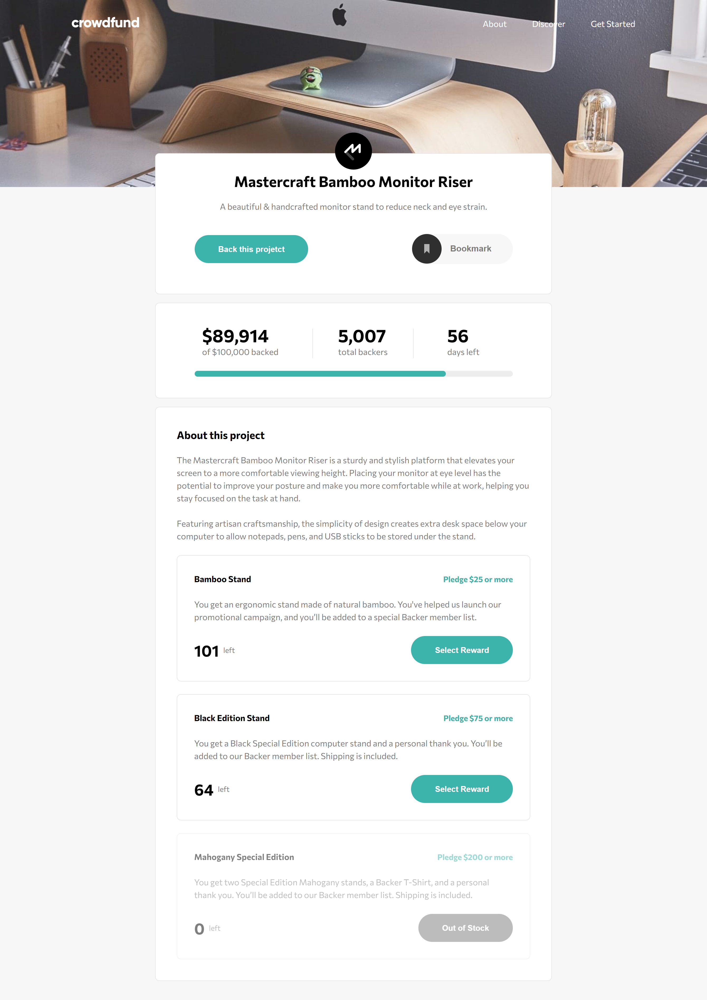
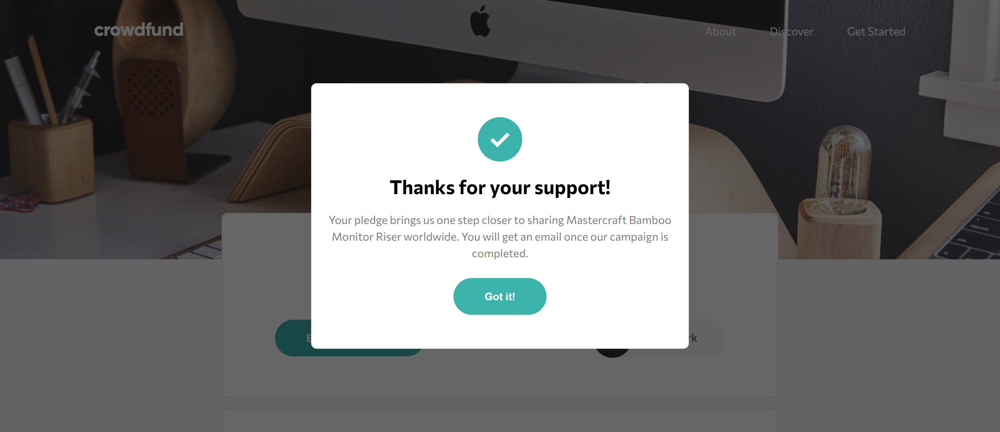

# Crowdfunding product page
Solução para criar uma página de produto de crowdfunding em HTML, CSS e JavaScript, responsiva para mobile e desktop

## Índice

- [Visão geral](#visao-geral)
  - [O Desafio](#o-desafio)
  - [Screenshot](#screenshot)
- [Minha caminhada](#minha-caminhada)
  - [Propriedades](#propriedades)
  - [O que aprendi](#o-que-aprendi)
  - [Recursos](#recursos)
- [Autor](#autor)

## Visão Geral

### O Desafio

Os usuários devem ser capazes de:

- Visualizar o layout ideal para o site, dependendo do tamanho da tela do dispositivo, mobile (375px) ou desktop (1440px)
- Visualizar os estados de foco para todos os elementos interativos na página

### Screenshots

<html>
    <h4>Layout mobile</h4>
    
    <h4>Menu mobile</h4>
    
    <h4>Modal de projetos</h4>
    
    <h4>Modal de agradecimento</h4>
    
    <h4>Layout desktop</h4>
    
    <h4>Modal de agradecimento</h4>
    
</html>

## Minha caminhada

- [x] Preparativos do layout com mobile-first 
- [x] Navbar
- [x] Product section
- [x] Metrics section
- [x] About section
- [x] Navbar menu
- [x] Product modal
- [x] Acknowledgment modal
- [x] Layout desktop
- [x] Estado de foco dos elementos

### Propriedades

- Mobile-first
- Semântica HTML
- CSS BEM
- CSS Flexbox
- CSS Grid
- CSS Reaproveitável, limpo e flexível

### Meu aprendizado
Ao longo do projeto tive que implementar dois modais, um de apresentação dos projetos de crowdfunding e outro de agradecimento. No processo aprendi que podemos utilizar uma tag especificar em HTML chamada "dialog", para auxiliar na dinâmica de abrir e fechar os modais, esse recurso conta com funções predefinidas em JavaScript, uma para mostrar o modal "showModal()" e outra para fechá-lo "close()".

Trechos de destaque:

HTML
```html
...
<button class="product__button-bookmark" id="acknowledgment__open-button">

  
  <a href="#">Bookmark</a>

</button>
...
<dialog class="modal-acknowledgment" id="modal-acknowledgment">

  <div class="modal-acknowledgment__container">

    
    <h2 class="titles">Thanks for your support!</h2>
    <p class="texts">Your pledge brings us one step closer to sharing Mastercraft Bamboo Monitor Riser worldwide. You will get an email once our campaign is completed.</p>
    <button class="product__button" id="acknowledgment__close-button">Got it!</button>

  </div>

</dialog>
```
CSS
```css
.modal-acknowledgment {
    background: var(--white);
    border-radius: 8px;
    text-align: center;
    padding: 3rem 1.2rem;
    border: 1px solid var(--mediu-gray);
    width: 76vw;
}
```
JavaScript
```javascript
// Constantes do modal de agradecimento
const modalAcknowOpenButton = document.querySelector("#acknowledgment__open-button")
const modalAcknow = document.querySelector("#modal-acknowledgment")
const modalAcknowCloseButton = document.querySelector("#acknowledgment__close-button")
    
    // Abrir modal de agradecimento
modalAcknowOpenButton.addEventListener("click", () => {
    modalAcknow.showModal()
})

    // Fechar modal de agradecimento
modalAcknowCloseButton.addEventListener("click", () => {
    modalAcknow.close()
})
```

### Recursos

- [HTML e JavaScrip - dialog](https://developer.mozilla.org/pt-BR/docs/Web/HTML/Element/dialog) - Aqui você aprende todas as possibilidades da tag HTML dialog e a manipulação de modal pelo DOM.

- [CSS - Blocos, Elementos e Modificadores](https://getbem.com/introduction/) - Este é um artigo que vai te fazer entender a boa prática, para nomear as suas classes.

- [O desafio da Frontend Mentor](https://www.frontendmentor.io/challenges/crowdfunding-product-page-7uvcZe7ZR) - Neste link você encontrará o desafio solucionado aqui.

## Autor

- LinkedIn - [Pedro A. Lima](https://www.linkedin.com/in/pedrolima626/)
